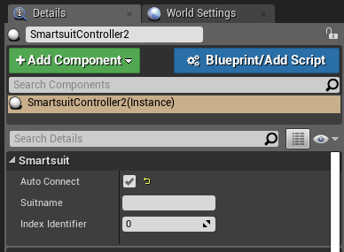
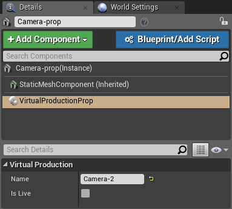
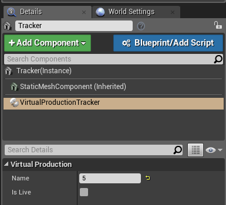
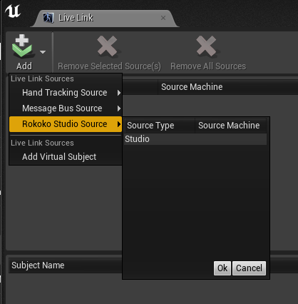
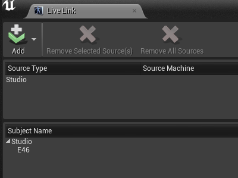
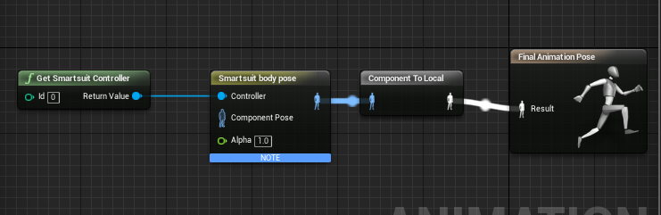

<h2 align="center"> Rokoko Studio - Sample project for Unreal Engine</h1>

[Rokoko Studio](https://www.rokoko.com/en/products/studio) is A powerful and intuitive software for recording, visualizing and exporting motion capture.

This sample project for Unreal Engine contains necessary means to get you started with your application.

---

## Getting Started

To learn more about how to use Virtual Production in Rokoko Studio, read our guide [here](https://rokoko.atlassian.net/servicedesk/customer/kb/view/861208607)

## Documentation

### Example Map

Content/SmartsuitAndPropsExampleMap

### Components

#### Smartsuit Receiver

A Smartsuit receiver can be added from the Modes panel. This component is required to receive data for character animation and virtual production.

| Parameter  | Description |
| ------------- | ------------- |
| Smartsuit -> Streaming Data Port  | The port that will be used to receive data from Studio for character animation (Smartsuits). This port needs to match Studio's data streaming forward port.  |
| Virtual Production -> VPListen Port  | The port that will be used to receive data from Studio for virtual production props and trackers. This port needs to match Studio's data streaming forward vp port.  |

#### Smartsuit Controller

A Smartsuit Controller can be added from the Modes panel. A Smartsuit Controller will bind to a Smartsuit and make the data accessible for animating a character.

| Parameter  | Description |
| ------------- | ------------- |
| Smartsuit -> Auto Connect  | If this is checked, the Smartsuit Controller will bind to the first Smartsuit that will appear in Smartsuit Receiver. Otherwise the Smartsuit -> Suitname will be used to bind to a Smartsuit with that name. |
| Smartsuit -> Suitname  | The name of the Smartsuit the component will bind to.  |
| Smartsuit -> Index Identifier  | An ID that can be used to access this Smartsuit Controller from blueprints.  |

#### Virtual Production Prop

You can add this component to any Actor in the level through the Add Component menu in the Details. This component will move and rotate the Actor based on the prop position and rotation. For this to work the Transform must be marked as Moveable.

| Parameter  | Description |
| ------------- | ------------- |
| Virtual Production -> Name  | The name of the prop to bind to. The name should match one of the prop names as defined in Studio. |
| Virtual Production -> Is Live  | If this toggle is checked, the prop will bind only for Live Props. If it is not checked, it will bind on playback props. This is used now to avoid conflicts when there's a playback with the same prop names as live.  |

#### Virtual Production Tracker

You can add this component to any Actor in the level through the Add Component menu in the Details. This component will move and rotate the Actor based on the prop position and rotation. For this to work the Transform must be marked as Moveable.

| Parameter  | Description |
| ------------- | ------------- |
| Virtual Production -> Name  | The name of the tracker to bind to. The name should match one of the tracker id as defined in Studio. That is a numerical value. |
| Virtual Production -> Is Live  | If this toggle is checked, the tracker will bind only for tive trackers. If it is not checked, it will bind on playback trackers. This is used now to avoid conflicts when there's a playback with the same tracker ids as live.  |

### Live Link and Virtual Camera support

Virtual production props can be used with Unreal's Live Link and Virtual Camera plugins. To connect VP data into Live Link, open the live link panel and select Rokoko Studio Source -> Studio. You can only add this source once.

The source subjects (props and trackers) will appear in Play mode and they will be updated to reflect the data forwarded from Studio. When the play mode ends, the subjects are removed. That is because the plugin only receives data from Studio in play mode.

The names of the subjects have the following patterns:
- for live props -> prop:L:propname
- for playback props -> prop:P:propname
- for live trackers -> tracker:L:X
- for playback trackers -> tracker:P:X

Having the Live Link plugin enabled we can now use a prop to control Unreal's virtual camera by setting the Live Link Target to the subject name of interest and Input Source to "Live Link"

For more information of how to setup Virtual Camera refer to Unreal's guide: https://docs.unrealengine.com/en-us/Engine/Plugins/VirtualCameraPlugin

### Live Link and Smartsuit Pro support

Smartsuit Pro data can be used with Live Link. With the Studio source enabled in LiveLink, when you have live Smartsuits Pro, you will see them by their IDs, (E46 in the picture).

The data coming from the Smartsuit Pro subjects, can be applied directly to our character located in our plugin (Smartsuit Content/Mesh/Newton/newtonalpha) using the Live Link Pose animation node and  the Retarget Asset NewtonAlphaLiveLinkRemap.

You can in play mode now see the character animated through Studio and Live Link.

The skeleton hierarchy is setup in the following way:

 - Base
 - - Hips
 - - - Spine
 - - - - Spine2
 - - - - - Neck
 - - - - - - Head
 - - - - - LeftShoulder
 - - - - - - LeftArm
 - - - - - - - LeftForeArm
 - - - - - - - - LeftHand
 - - - - - RightShoulder
 - - - - - - RightArm
 - - - - - - - RightForeArm
 - - - - - - - - RightHand
 - - - LeftUpLeg
 - - - - -LeftLeg
 - - - - - - LeftFoot
 - - - RightUpLeg
 - - - - RightLeg
 - - - - - RightFoot

The NewtonAlphaLiveLinkRemap asset, remaps the following bone names:

Spine2 → Spine4

LeftUpLeg → LeftThigh

LeftLeg → LeftShin

RightUpLeg → RightThigh

RightLeg → RightShin

### Blueprints

#### Character animation blueprint example

To animate a character you have to use the nodes "Get Smartsuit Controller" and "Smartsuit body pose". In Smartsuit body pose you have to map the bones of your character. 

## Issues

File a bug in [GitHub Issues](https://github.com/RokokoElectronics/rokoko-studio-unreal-sample-project/issues)

## License

Copyright (c) Rokoko Electronics ApS. All rights reserved.

Licensed under the [GNU GPLv3](https://github.com/RokokoElectronics/rokoko-studio-unreal-sample-project/blob/master/LICENSE.md) License.
