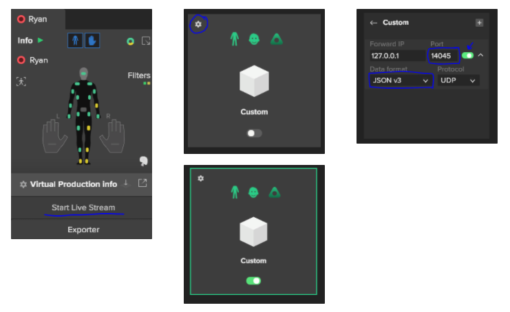

<h2 align="center"> Rokoko Studio Live - Sample project for Unreal Engine</h1>

[Rokoko Studio](https://www.rokoko.com/en/products/studio) is A powerful and intuitive software for recording, visualizing and exporting motion capture.

This sample project for Unreal Engine contains necessary means to get you started with your application.

---

## Getting Started

To learn more about how to use Virtual Production in Rokoko Studio, read our guide [here](https://help.rokoko.com/support/solutions/47000518297)

## Documentation

### Finger animation setup on character's with Studio Live and Smartgloves

Studio Live now supports the new Rokoko Smartgloves in Unreal Engine 4.25.3 and Rokoko Studio version 1.18.0b(234)

**Making sure the model is ready for Studio Live**

Before importing your model into Unreal Engine. Make sure that the character's hands and fingers are modeled as close to the Newton model as possible, to get the best possible retargeting of finger animation. The fingers should be straight and the thumb pointing 45 degrees away from the other fingers.

Studio Live supports up to a 4 finger joint setup: Metacarpal, Proximal, Medial and Distal finger joint.

**Getting the plugin to work manualy**

For the plugin to work at its current state you need this development buid of Rokoko Studio: [https://developer.cloud.unity3d.com/share/share.html?shareId=-koPxa5S4I](https://developer.cloud.unity3d.com/share/share.html?shareId=-koPxa5S4I)

Then you need to download the Studio Live plugin and install it manualy by moving it into your Unreal project's **plugins folder:** [https://github.com/Rokoko/rokoko-studio-live-unreal-engine/tree/4.25_jsonv3/Plugins](https://github.com/Rokoko/rokoko-studio-live-unreal-engine/tree/4.25_jsonv3/Plugins)

_Note: If your unreal project doesn't have a plugins folder, then create a folder called "Plugins"._

Now when you open your project a pop-up error will appear. Click yes to it and wait for it to build. If the building fails, you need to go into **Visual Studio Installer.**

Open up Visual Studio Installer and click on Individual Components. Then search for Unreal Engine Installer and install that. Now open the Demo project again and say yes to the pop-up and it should built.

If it still doesn't work install theise optional packages under **desktop development with C++.**

When the unreal project is open, go into settings → Plugins and search for **Rokoko Studio Live** and make sure the enable mark is on. If you clicked enable you have to restart the urneal project. 

**Setting up the character inside Unreal Engine 4.25**

When the character is imported into Unreal Engine. Right-click on the **character** **skeletal mesh** and select **Create** and then **Anim blueprint.** Name it character_AnimBP and then open it. 

Inside the anim blueprint create a "**Rokoko body pose**", "**Component to local**" and a "**Rokoko Face Pose**" node. Connect them in that order and then to the **Output Pose.**

Now click on the **plus** next to variables and change the variable type to **Name** and the variable name to **Rokoko Actor Name**. Then drag it out into the animGraph and chose **Get Rokoko Actor Name**. Connect it to Rokoko Body Pose and the Rokoko Face Pose.

Right-click on the content browser and navigate to miscellaneous and create a **Data Asse**. Name it something like **character_BoneMap.** Now open it and write the names of the corresponding joints in the hierarchy. (If you use the same joint naming on more characters you can reuse this data asset)

When the BoneMap is done open the AnimBP again and click on Rokoko Body Pose. Then you can click on the **Bone** **Map Overwrite** and chose your Data Asset.

Now add the character skeletal mesh to the scene and navigate to the details panel and pick your animBlueprint under **Animation → Anim Class.** Then under Place Actors search for **Smartsuit controller** and **Smartsuit Reciever** and drag them into the scene. Click on the S**martsuit Receiver** in the **world outliner** and change the Streaming Data Port to **14043.**

To enable Rokoko Studio, go to Window → Studio Live and under **Source** click on R**okoko Studio Source** and choose **Studio**.

**Setting up Rokoko studio for Studio Live** 
When the scene is open and the suit is paired up with a profile. Go to **Start Live Stream.**
Then navigate to **Custom** and click on the cogwheel. 
Now change the port to **14045** and change the Data format to **JSON v3**. Then click on the little slider beside the port number.

**Show the Rokoko Studio UI inside Unreal Engine**
In the content browser, click on **View Options** and enable **Show Plugins Content.** Then in the content view find **Widgets** under **Smartsuit Content**, and drag it into the scene. This will enable the UI when streaming from Rokoko Studio.

Inside Unreal Engine click **Play** and the suit and gloves should be setup with Studio Live, from Rokoko Studio.

## Issues

File a bug in [GitHub Issues](https://github.com/RokokoElectronics/rokoko-studio-unreal-sample-project/issues)

## License

Copyright (c) Rokoko Electronics ApS. All rights reserved.

Licensed under the [GNU GPLv3](https://github.com/RokokoElectronics/rokoko-studio-unreal-sample-project/blob/master/LICENSE.md) License.
